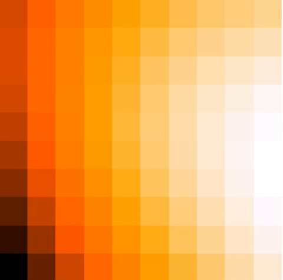

# Screen Fitting

## Description
This module can be used to convert a direction dependent calibration file (in h5 format) into a set of screens (image cube in fits format).
The input calibration file has one solution per antenna, frequency and solution interval; the output has instead one screen per antenna, frequency and solution interval. 
There are two algotihms available for screen fitting:
- Voronoi
- Karhunen Loeve

The screens obtained can be used to apply direction dependent effects during the imaging process with IDG in WSClean. 
Refer to https://wsclean.readthedocs.io/en/latest/a_term_correction.html?highlight=screen in the section "Diagonal gain correction" for more details.

## Badges
TODO

## Visuals
The gif below shows the output of the KL (left) and Voronoi (right) screen-fitting algorithm for a fixed station and solution interval, varying in frequency. 




## Installation
In order to clone and work with this repository, you need to have poetry installed. You can get it with:
```curl -sSL https://raw.githubusercontent.com/python-poetry/poetry/master/get-poetry.py | python3 - ```

Clone the repository with its submodules
``` 
git clone --recursive https://gitlab.com/ska-telescope/sdp/ska-sdp-screen-fitting.git
git submodule init
git submodule update  
cd ska-sdp-screen-fitting
```

Enter poetry virtual environment and build the project
```
poetry shell
poetry build && poetry install
```
Now you can use the make instructions of the submodule and run (for example) the tests:
```
make python-build
make python-test
```
You can also format the code with ```make python-format``` and check the linting with ```make python-lint```

## Usage 
After running ```make python-build``` as specified in the above section, a .whl package will be available in the "dist" folder. If you want to use this package in your repository, you can install this package with ```pip install package_name.whl``` , replacing "package_name" with the actual name in your dist folder. You will be able to import the package and used as in the example below.
```
from ska_sdp_screen_fitting.make_aterm_images import make_aterm_image
make_aterm_image(
    "solutions.h5",
    soltabname="phase000",
    screen_type="tessellated",
    outroot="",
    bounds_deg=[126.966898, 63.566717, 124.546030, 64.608827],
    bounds_mid_deg=[125.779167, 64.092778],
    skymodel="skymodel.txt",
    solsetname="sol000",
    padding_fraction=1.4,
    cellsize_deg=0.2,
    smooth_deg=0,
    ncpu=0
)
```
where the files "solution.h5" and "skymodel.txt" can be found in the "resources" folder of the repository.


## Authors and acknowledgment
TODO

## License
TODO